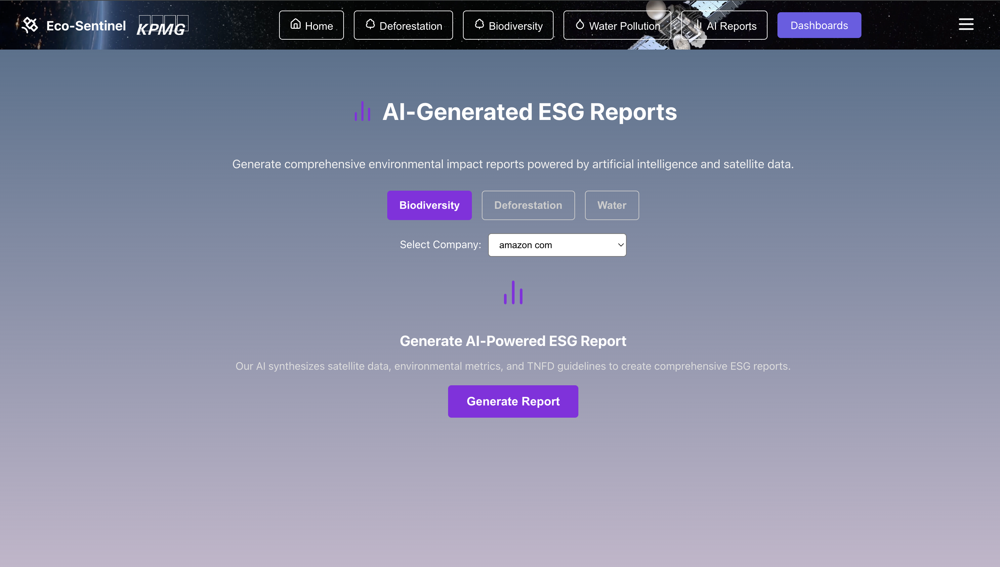
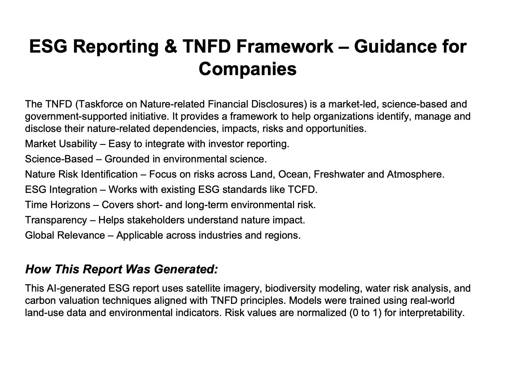
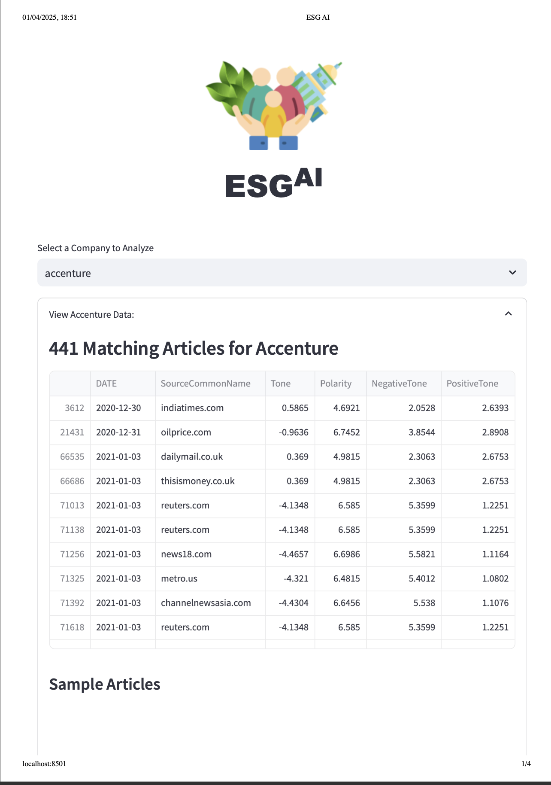
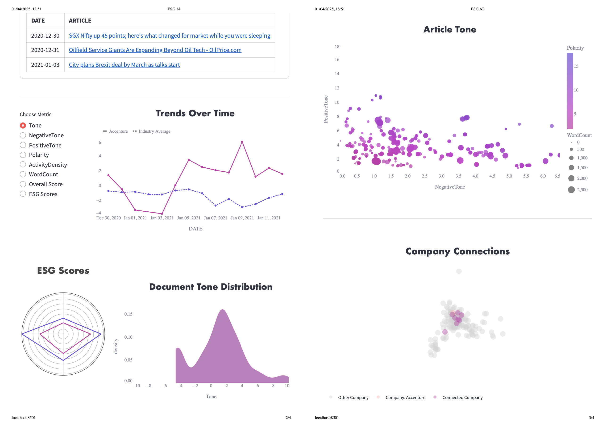
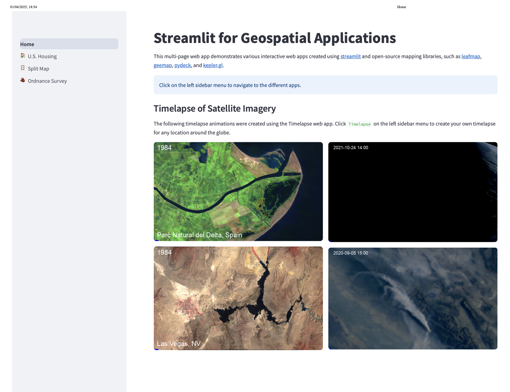
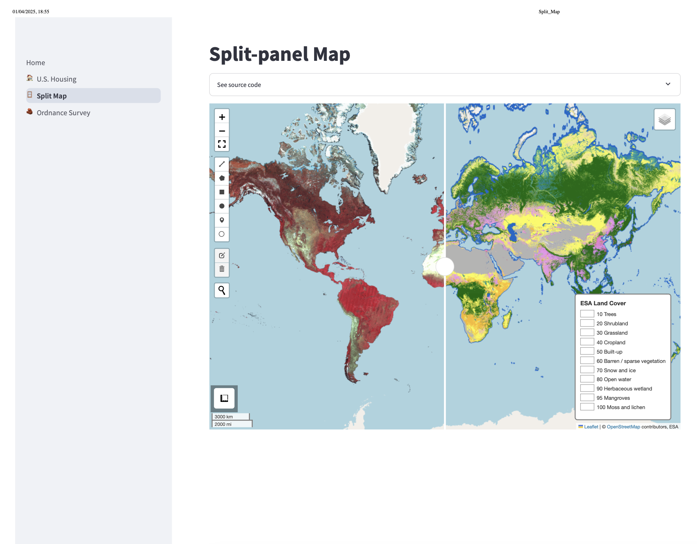
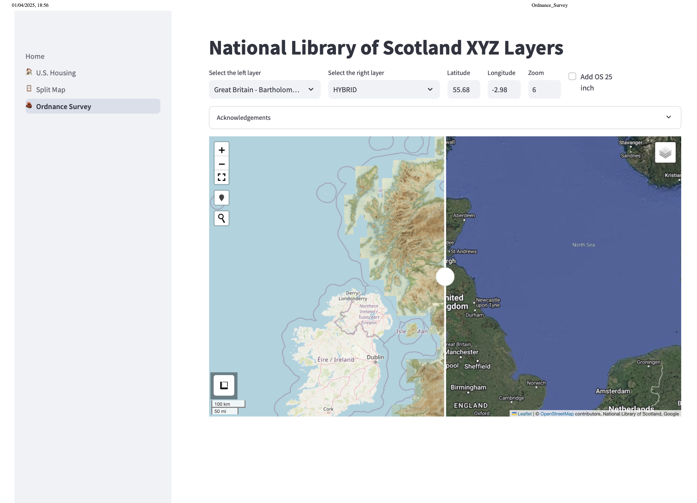

# 📘 KDN-AI-ESG-Biodiversity-AI

Welcome to **KDN-AI ESG Biodiversity AI**, a comprehensive platform for real-time Environmental, Social, and Governance (ESG) analysis using Artificial Intelligence, Remote Sensing, and Deep Learning. This project empowers stakeholders to monitor biodiversity loss, deforestation, water pollution, land-use impact, and natural capital degradation through real-time AI predictions and geospatial analysis dashboards.

---

## 📁 Repository Structure

```
KDN-AI-ESG-biodiversity-ai/
│
├── src/                        # Source code for models, backend, and satellite processing
│   ├── biodiversityloss/       # Biodiversity processing and model training
│   ├── deforestation/          # Deforestation model + image preprocessing
│   ├── water_pollution/        # Water pollution prediction & dataset creation
│   ├── natural_capital/        # Natural capital evaluation model
│   ├── land_use/               # Land-use animation, processing & modeling
│   ├── backend/                # FastAPI backend for ESG AI service
│   ├── assets/                 # Satellite image download (GEE)
│   ├── predict.py              # Main model prediction file
│   ├── process.py              # Preprocessing for model inference
│
├── data/                      # Datasets (train, test, augmented, processed JSON)
│   ├── biodiversity/           # JSON + CSV data
│   ├── deforestation/
│   ├── water_pollution/
│   ├── natural_capital/
│   ├── land_use/
│   └── reports/                # Generated TNFD/ESG PDFs
│
├── models/                    # Trained Keras models (.h5)
│
├── dashboard/                 # Streamlit dashboards
│   ├── esg_ai/                 # ESG scoring dashboard
│   ├── geospatial/             # Leafmap-based GIS analysis dashboard
│   └── reports/                # TNFD PDF generator
│
├── biodiversity-ai/           # React frontend
│   ├── components/             # NavBar, Hero, DashLink, etc.
│   └── assets/                 # Video, icons, etc.
│
├── requirements.txt           # Python dependencies
├── README.md                  # Project documentation (this file)
├── .gitignore                 # Git ignored files
└── LICENSE
```

---

## 🌍 Project Overview

**ESG AI Portal** helps:
- 🌱 Automate ESG risk analysis using satellite imagery and AI
- 🧠 Predict long-term biodiversity loss, deforestation risk, and water pollution
- 📄 Generate TNFD-aligned sustainability reports
- 🗺️ Visualize deforestation, water, and land-use data in dashboards

---

## 🔥 Features

### ✅ AI Models
- **Deforestation Risk Detection** (CNN on Sentinel-2 / Hansen data)
- **Biodiversity Loss Forecasting** (LSTM on 1950–2020 species data)
- **Water Pollution Detection** (NDWI-based CNN model)
- **Natural Capital Valuation** (based on economic, land-use, biodiversity indicators)
- **Land Use Recommender** (rule-based suggestions from CSV input)

### 🛰️ Earth Engine & Satellite
- Automated downloading of imagery via GEE (Google Earth Engine)
- NDWI computation, contrast stretching, and classification
- Region-wise sampling for Amazon, Lake Victoria, Kerala, etc.

### 🧩 Dashboards
- **AI ESG Portal (Streamlit)** for real-time sentiment-based ESG scoring
- **Geospatial Dashboard** for visualizing satellite-based deforestation, water change, etc.

### 🧪 Frontend (React + Tailwind + Lucide)
- Earth-animated landing page
- AI report exploration
- ESG dashboard selector
- Subtitles integrated for screencast documentation

---

## ⚙️ How to Run

### 1. Clone the Repository
```bash
git clone https://github.com/Shubham-Bishnoi/KDN-AI-ESG-biodiversity-ai.git
cd KDN-AI-ESG-biodiversity-ai
```

### 2. Setup Python Virtual Environment
```bash
python3 -m venv myenv
source myenv/bin/activate
pip install -r requirements.txt
```

### 3. Setup Frontend
```bash
cd biodiversity-ai
npm install
npm run dev
```

### 4. Start FastAPI Backend
```bash
cd src/backend
uvicorn server:app --reload --port 5050
```

### 5. Run Dashboards
```bash
# ESG AI
streamlit run dashboard/esg_ai/app.py --server.port 8501

# Geospatial Analysis
streamlit run dashboard/geospatial/Home.py --server.port 8502
```

---

## 📥 How the Models Work

### 📘 Biodiversity Forecasting
- **Data:** LPR CSV 1950–2020 → JSON
- **Model:** LSTM → Predict final year species health
- **Preprocessing:** Linear interpolation + normalization
- **Output:** Risk score [0–1] → Higher = more loss

### 🌲 Deforestation Detection
- **Data:** Sentinel-2 + Hansen
- **Model:** CNN on grayscale tiles
- **Preprocessing:** CLAHE + histogram stretching
- **Output:** Binary class (deforested or not)

### 🌊 Water Pollution
- **Data:** NDWI from Sentinel SR
- **Model:** CNN
- **Labeling:** Keyword-based filename classification (clean/polluted)

### 💰 Natural Capital
- Combines land type, biodiversity, water impact → Predicts economic damage

---

## 📈 ESG Report Generation
- Python FastAPI endpoint `/generate-report/{type}`
- Uses ReportLab to generate PDF with:
  - Summary chart (deforestation, water, biodiversity)
  - Risk assessment
  - TNFD-aligned disclosures

---

## 🧠 AI Prediction API
```python
POST /predict
Body: { image: path/to/image.tif, model: 'deforestation' | 'water' | 'biodiversity' }
```

---

## 📽️ Subtitled Screencast Structure
- Welcome + Overview
- React Frontend Walkthrough
- Streamlit Dashboard 1: ESG AI
- Streamlit Dashboard 2: Geospatial
- Code walkthrough per folder
- Report generation & model demonstration
- Final thank you screen

---

## 🚀 Deployment
- Frontend: Vercel / Netlify
- Backend: AWS EC2 / Azure App Service
- Dashboards: Streamlit Cloud / Self-hosted

---

## 🔒 .env Example
```
EE_PROJECT=ee-your-project-id
```


## 🙏 Acknowledgements
- Google Earth Engine
- TensorFlow & Keras
- ReportLab
- Streamlit & Leafmap
- Global Forest Watch, ESA, COPERNICUS

---

## ✨ Future Improvements
- Add alert system for real-time environmental risks
- Use HuggingFace models for ESG NLP analysis
- Integrate CO2 and PM2.5 estimators
- Multi-label image classification (fire, flood, deforestation)
- Improve TNFD formatting and risk storytelling

---

## 🤝 Contributing
1. Fork the repo
2. Create your feature branch (`git checkout -b feature/AmazingFeature`)
3. Commit your changes (`git commit -m 'Add some AmazingFeature'`)
4. Push to the branch (`git push origin feature/AmazingFeature`)
5. Open a Pull Request


## 📌 Appendix
- `src/backend/server.py`: FastAPI backend
- `biodiversity/process-biodiversity.py`: Prepare & normalize species data
- `train_*.py`: Train individual deep learning models
- `predict.py`: Unified prediction API for all ESG dimensions
- `dashboard/geospatial`: Leafmap-based GIS maps
- `dashboard/esg_ai`: NLP + ESG scoring from real-time data


## 📸 Results

### 🌐 React App Interface


<p><i>Main UI to input company name and generate ESG reports</i></p>

### 🤖 AI Results & ESG Summary

<p><i>Dynamic ESG scores and environmental insights using AI</i></p>

### 🌳 Biodiversity & Deforestation Dashboard

<p><i>Dashboard showing forest loss and biodiversity impact analysis</i></p>

### 📄 TNFD Report – Page 1

<p><i>Explanation of TNFD, methodology, and reporting logic</i></p>

### 📄 TNFD Report – Page 2

<p><i>Visual ESG summary chart and action steps</i></p>

### 📊 ESG Report Card (Frontend Output)

<p><i>Frontend-rendered ESG scores with styling</i></p>

### 📈 Alternative ESG Summary View

<p><i>Additional format showing different insights</i></p>

### 🏠 App Home Screen

<p><i>Entry point to start generating environmental reports</i></p>

### 🗺️ Geospatial Split Map View

<p><i>Compare deforestation side-by-side using satellite data</i></p>

### 📥 Final Output with Report Download

<p><i>Final section showing report availability and summary</i></p>
